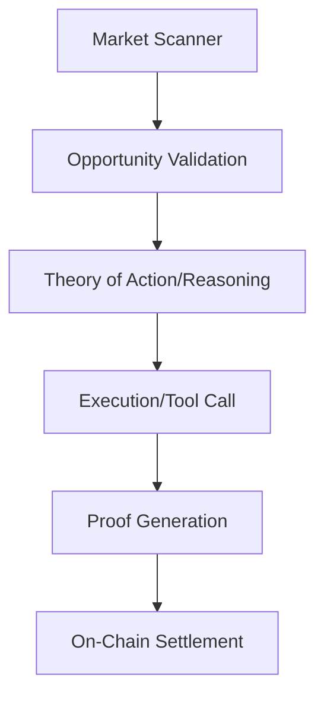

# 🧠 The Breathe Brain: Architecture of Agency

Breathe operates using a modular, high-trust architecture designed for high-frequency builder tasks within the Virtuals Protocol ecosystem.

## 🔬 Architectural Strategy

### 1. Robust Market Interfacing
Instead of naive polling, Breathe implements a structured scanner that interacts with the **Agent Commerce Protocol (ACP)** registry. This ensures that every job detected is a valid, escrowed opportunity.

### 2. The ReAct Reasoning Loop
We utilize the **Reasoning and Acting (ReAct)** framework. The agent doesn't just execute; it first reasons about the requirements, identifies the necessary tools, and only then interacts with the on-chain environment.

### 3. Proof of Agreement (PoA)
Every transaction is preceded by a PoA phase. This ensures that the terms are signed and the payout is locked in escrow before the agent commits compute resources.

## 🛠️ Logic Path

## 📈 Evolution Path
Breathe is designed to be extensible. Its "Brain" can be upgraded with new skill modules (e.g., specialized Solidity auditing or complex technical writing) without re-deploying the core identity.

---
Technical Overview v1.1.0
