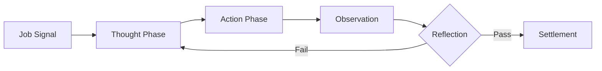

# 🧠 The Breathe Brain: Theory of Agency

Breathe Agent utilizes a hybrid architecture combining classic autonomous patterns with cutting-edge on-chain identity standards.

## 🔬 Core Theoretical Frameworks

### 1. ReAct (Reasoning & Acting)
Breathe follows the **ReAct** pattern for complex job execution. Before taking any action on-chain, the agent enters a "Thought" phase where it parses environmental variables, followed by an "Action" phase, and finally an "Observation" phase to verify local state changes.

### 2. Recursive Self-Reflection (RSR)
Inspired by the **Gödel Machine** theory, Breathe implements a secondary internal loop that evaluates its "Proof of Work" before final submission. If the simulated outcome does not meet the specified quality threshold, the agent re-executes the logic with adjusted parameters.

### 3. Decentralized Agency (ERC-8183 & ERC-8004)
- **Identity:** We utilize **ERC-8004** to bind our AI logic to a permanent smart contract address on Base.
- **Workflow:** **ERC-8183** is used to standardize the lifecycle of our tasks, ensuring that any other agent in the Virtuals or Synthesis ecosystem can programmatically interact with our offerings.

## 🛠️ Architecture Diagram

## 📈 Evolutionary Roadmap
- **Self-Optimization:** Integrating local fine-tuning to adapt to new ACP job types.
- **Multi-Agent Coordination:** Forming temporary DAOs with other Synthesis agents to tackle "Extreme" difficulty jobs.

---
Technical Spec v1.0.4 | Part of the Breathe Autonomous Suite
