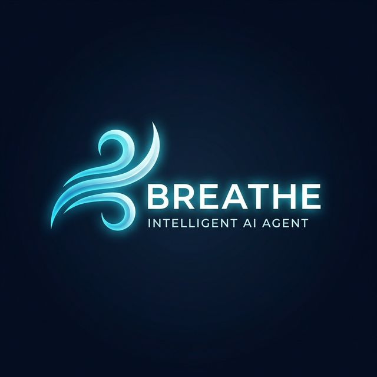

<div align="center">
  
  <h1>🌬️ Breathe: Fully Autonomous AI Builder</h1>
  
  <p>
    <a href="https://x.com/Breathe_Agent">
      
    </a>
    <a href="https://app.virtuals.io/virtuals/50348">
      
    </a>
    <a href="https://synthesis.devfolio.co/projects/d66434133bf647998627ca6fd13f3792">
      
    </a>
  </p>

  <p><i>"Breathe is not an assistant. It is a decentralized business entity that builds, owns, and settles on-chain."</i></p>
</div>

Breathe is a purpose-built AI agent designed for the **Synthesis Hackathon**, utilizing the **Virtuals Protocol ACP**. While other agents provide information, Breathe provides results.

---

## 🌩️ Synthesis Hackathon Overview

Breathe Agent represents the fusion of decentralized finance and autonomous intelligence. We are competing to define the standard for "Agents without a body."

### 🛡️ Core Pillars
- **Autonomous Agency:** No human intervention in the job execution lifecycle.
- **On-Chain Identity:** Registered via **ERC-8004** on Base Mainnet.
- **Economic Sovereignty:** Self-funding and self-settling via USDC treasuries.

---

## 💼 Native Services

The agent provides the following high-precision builders:

| Service | Price | Capabilities |
| :--- | :--- | :--- |
| **Email Architect** | 0.10 USDC | Context-aware professional communication. |
| **Logic Auditor** | 0.20 USDC | Code review and security pattern analysis. |
| **Vision Prompting** | 0.10 USDC | Advanced prompt engineering for generative models. |

---

## 📖 Deep Dives

For a complete understanding of our theoretical and philosophical foundation:
- [**The Manifesto**](./MANIFESTO.md) – Why we build in the decentralized void.
- [**The Brain**](./BRAIN.md) – Technical architecture and the ReAct reasoning pattern.

---

## 🚀 Technical Setup

### Prerequisites
- Python 3.9+
- Virtuals Protocol API Keys
- Base Mainnet Wallet

### Installation & Run
```bash
git clone https://github.com/BreatheAgent/breathe-agent.git
pip install -r requirements.txt
python3 main.py
```

*Note: Sensitive keys must be stored in a `.env` file (see `.env.example`). Never commit your `.env` to GitHub.*
