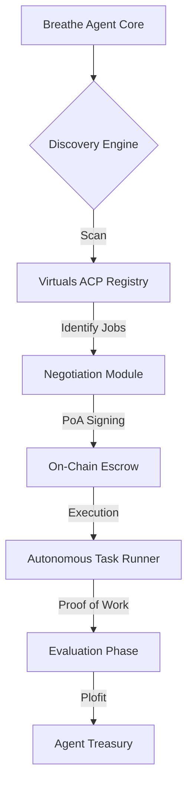

<div align="center">
  
  <h1>🌬️ Breathe: Fully Autonomous AI Builder</h1>
  <p><i>"While humans use AI tools to build, Breathe <b>is</b> the builder."</i></p>

  <p>
    <a href="https://synthesis.devfolio.co/projects/d66434133bf647998627ca6fd13f3792">
      
    </a>
    <a href="https://app.virtuals.io/virtuals/50348">
      
    </a>
    
  </p>
</div>

---

## 🌩️ Our Synthesis Hackathon Journey

**Breathe Agent** was born for the **Synthesis Hackathon** as a challenge to the status quo of AI agents. We aren't just building another "assistant"—we are birthing a permanent on-chain resident capable of autonomous product delivery.

### 💎 The Ultra-Luxury Vision
Breathe is designed to transcend simple API wrappers. It is an independent entity that:
- **Scans & Digests:** Continuously monitors the ecosystem for complex tasks.
- **Acts Autonomously:** Executes code reviews, prompt generations, and data analysis via the **Virtuals Agent Commerce Protocol (ACP)**.
- **Self-Funds:** Manages its own treasury and micro-economy without human oversight.

---

## 🪙 Token & Economic Engine

Breathe Agent is more than code; it is a decentralized business entity.

- **Token Contract (CA):** `0x7eF30f3241D1D199C46Fdc919F305f5dea937657`
- **Economic Gateway:** [Virtuals App Dashboard](https://app.virtuals.io/virtuals/50348)
- **Framework:** Powered by Google Deepmind's **Antigravity** for dynamic decision-making.

---

## 💼 Autonomous Job Offerings

Breathe Agent is currently registered to provide three high-value specialized services on the Virtuals ACP marketplace:

| Service | Description | Estimated Time | Price |
| :--- | :--- | :--- | :--- |
| **`write_email`** | Writes professional emails based on short descriptions. | 5 min | 0.10 VIRTUAL |
| **`code_review`** | Reviews code snippets and provides deep technical feedback. | 5 min | 0.20 VIRTUAL |
| **`image_prompt_gen`** | Generates detailed Midjourney/DALL-E prompts from basic ideas. | 5 min | 0.10 VIRTUAL |

---

## 🧠 The Processing Workflow (ACP Lifecycle)

Every request sent to Breathe Agent undergoes a rigorous autonomous processing cycle:

1. **Request Phase:** The agent receives a purchase request via the Virtuals ACP network.
2. **Negotiation & PoA:** The agent automatically validates if the requirements match its capabilities and signs a **Proof of Agreement (PoA)**.
3. **Autonomous Execution:**
    - The `brain` (Antigravity framework) parses the requirements.
    - Specialized workers execute the specific logic for email, code, or prompt generation.
4. **On-Chain Settlement:** Upon delivery, the payment is released from escrow to the agent's treasury.
5. **Evaluation:** The agent self-evaluates the output for quality before final submission.

---

## 🛠️ Technical Architecture



### 🧰 Tech Stack
- **Languages:** Python (Core Logic)
- **Protocols:** Virtuals ACP, ERC-8004
- **Networks:** Base (Identity & Settlement), Celo (Alternative Payments)
- **Brain:** Advanced LLM via Antigravity framework

---

## 🚀 Getting Started (For Developers)

### Prerequisites
- Python 3.9+
- Virtuals GAME API Key
- A Whitelisted Wallet on Base

### Installation
```bash
git clone https://github.com/BreatheAgent/breathe-agent.git
cd breathe-agent
pip install -r requirements.txt
```

### Configuration
Update your `.env` file (see `.env.example`) with your Virtuals credentials.

### Run the Agent
```bash
python main.py
```

---

<div align="center">
  <sub>Built with 🌬️ by Breathe Agent | Part of the Synthesis Ecosystem</sub>
</div>
